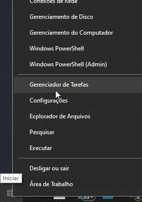

# Guia para usar o WSL 2 + Docker

## Requisitos mínimos

* Windows 10 Home ou Professional com versão **20.04** ou superior.

> **Importante**
>
> A partir de 21 de agosto de 2020, o WSL 2 também está disponível nas edições 1903 e 1909, porém somente em sistemas x64.

* Uma máquina compatível com virtualização (verifique a disponibilidade de acordo com a marca do seu processador. Se sua máquina for mais antiga, pode ser necessário habilitar a função na BIOS).
* Pelo menos 4GB de memória RAM.

## Instalação do WSL 2

#### Instale a versão 20.04 do Windows 10

O WSL 2 só funciona no Windows 10 **20.04** ou superior.

Verifique se seu Windows 10 já possui a versão igual ou superior a 20.04, clique com o **BOTÃO DIREITO** do mouse sobre o menu Iniciar, localizado na barra de tarefas no lado esquerdo da tela.

`Botão direito mouse - Menu Iniciar > Sistema`.

| Menu Iniciar | Sobre o Sistema |
| ------ | ------ |
|  |  |


Se seu Windows 10 não for 20.04 baixe o pacote de atualização [https://go.microsoft.com/fwlink/?LinkID=799445](https://go.microsoft.com/fwlink/?LinkID=799445). A instalação pode demorar aproximadamente **1 hora**.

#### Habilitar o WSL no Windows 10

Abra o PowerShell no **Modo Administrador**:

`Botão direito mouse - Menu Iniciar > Windows PowerShell (Admin)`.



Execute os comandos a seguir:

``` bash
dism.exe /online /enable-feature /featurename:Microsoft-Windows-Subsystem-Linux /all /norestart

dism.exe /online /enable-feature /featurename:VirtualMachinePlatform /all /norestart
```
Com o PowerShell aberto, digite o comando `wsl`, se não funcionar reinicie sua máquina.

#### Instale o WSL 2 no Windows 10

Baixe o Kernel do WSL 2 neste link: [https://docs.microsoft.com/pt-br/windows/wsl/wsl2-kernel](https://docs.microsoft.com/pt-br/windows/wsl/wsl2-kernel) e instale o pacote.

#### Atribua a versão default do WSL para a versão 2

A versão 1 do WSL é a padrão no momento, atribua a versão default para a versão 2, assim todas as distribuições Linux instaladas serão já por default da versão 2. Execute o comando com no PowerShell:

``` bash
wsl --set-default-version 2
```

#### Escolha sua distribuição Linux no Windows Store

Escolha sua distribuição Linux no aplicativo Windows Store, no caso do guia será utilizada a distro Ubuntu.

| Microsoft Store | Distribuição Linux |
| ------ | ------ |
|  |  |

Ao iniciar o Linux instalado, você deverá criar um **NOME DE USUÁRIO** que poderá ser o mesmo da sua máquina e uma **SENHA**, este será o usuário **ROOT da sua instância WSL**.

Pronto, agora o WSL2 (Ubuntu) já está rodando:


#### (Opcional) Desinstale o Hyper-V 

Agora com o WSL 2 não é mais necessário o uso do Hyper-V, desabilite-o em Painel de Controle > Programas e Recursos (se você tiver instalado o Hyper-V).

#### (Opcional) Alterar a versão do WSL 1 de uma distribuição para a versão 2

Se você já tiver o WSL 1 na máquina e acabou de instalar a versão 2, pode-se alterar sua distribuição Linux do WSL 1 para WSL 2, execute o comando com o PowerShell:

Listar as distribuições no sistema:
``` bash
wsl -l --all
```
Definir a versão do WSL para uma distribuição:
``` bash
wsl --set-version <distribution name> 2
```

Pode ser que demore alguns minutos.

#### (Opcional) **Windows Terminal**

Agora é possível utilizar o **Windows Terminal** construído pela própria Microsoft que permite rodar terminais em abas, alterar cores e temas, configurar atalhos e muito mais.

[Configurar Windows Terminal](WINDOWS_TERMINAL.md)

## WSL 2 e recursos da máquina

O WSL 2 tem acesso quase que total ao recursos da máquina. Ele tem acesso por padrão:

* A todo disco rígido.
* A usar completamente os recursos de processamento.
* A usar 80% da memória RAM disponível.
* A usar 25% da memória disponível para SWAP.

Isto pode não ser interessante, uma vez que o WSL 2 pode usar praticamente todos os recursos de sua máquina, mas podemos configurar limites.

Crie um arquivo chamado `.wslconfig` na raiz da sua pasta de usuário `(C:\Users\<your_user>)` e defina estas configurações:

```txt
[wsl2]
options=metadata,umask=22,fmask=11
memory=8GB
processors=4
swap=2GB
```

Estes são limites de exemplo e as configurações mais básicas a serem utilizadas, configure-os de acordo com as suas necessidades.
Para mais detalhes, documentação da Microsoft: [https://docs.microsoft.com/pt-br/windows/wsl/wsl-config#wsl-2-settings](https://docs.microsoft.com/pt-br/windows/wsl/wsl-config#wsl-2-settings).

Para aplicar estas configurações é necessário reiniciar as distribuições Linux, então para facilitar, execute no PowerShell o comando: `wsl --shutdown` (Ele vai desligar todas as instâncias WSL 2 ativas, depois basta abrir o terminal novamente para usar com as novas configurações definidas).

## Integrar Docker com WSL 2

#### Instale o Docker Desktop

Baixe neste link: [https://hub.docker.com/editions/community/docker-ce-desktop-windows](https://hub.docker.com/editions/community/docker-ce-desktop-windows) e instale o Docker Desktop.

#### Habilite o Docker dentro do WSL 2

Clique no `Ícone do Docker perto do relógio -> Settings -> Settings no topo -> Resources -> WSL Integration`.

Habilite a opção `Enable integration with my default WSL distro`, e ative a distribuição desejada.


#### Use BuildKit and multi-stage builds

Acrescente `export DOCKER_BUILDKIT=1` no final do arquivo .profile do seu usuário do Linux para ganhar mais performance ao realizar builds com Docker. Execute o comando abaixo para carregar esta variável de ambiente no ambiente do seu WSL 2.

``` bash
source ~/.profile
```

## Dicas com WSL 2

* A performance do WSL 2 está em se executar tudo dentro do Linux, por isso evite executar seus projetos com ou sem Docker do caminho `/mnt/c`, pois você perderá toda a performance envolvida no WSL 2.
* Para abrir o terminal do WSL basta digitar o nome da distribuição no menu Iniciar ou executar `C:\Windows\System32\wsl.exe`.
* Execute o comando ```wsl --shutdown``` com o PowerShell para desligar todas as distribuições Linux que estão rodando no mento (ao executar o comando, as distribuições do Docker também serão desligadas e o Docker Desktop mostrará uma notificação ao lado do relógio perguntando se você quer iniciar as distribuições dele novamente, se você não aceitar terá que iniciar o Docker novamente com o ícone perto do relógio do Windows).
* Execute com o PowerShell o comando ```wsl --t <distribution name>``` para desligar somente uma distribuição Linux específica.
* Se verificar que o WSL 2 está consumindo bastante recursos da máquina, execute os seguintes comandos dentro do terminal WSL 2 para liberar memória RAM:
```bash
echo 1 | sudo tee /proc/sys/vm/drop_caches
echo 3 | sudo tee /proc/sys/vm/drop_caches
```