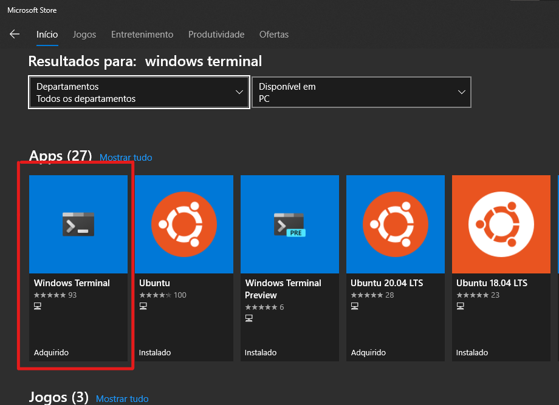
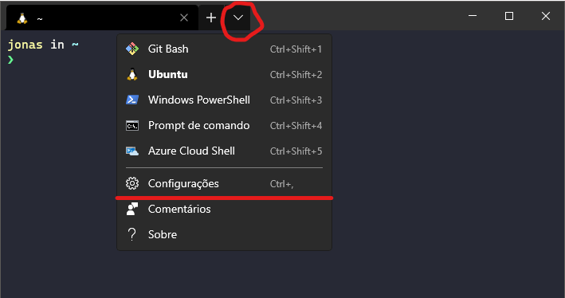

# Configurando Windows Terminal
Instale-o pelo Windows Store e use estas [configurações padrões](terminal-settings.json) para habilitar WSL 2, Git Bash e o tema drácula e alguns atalhos.

#### Instalação:
| Microsoft Store | Windows Terminal |
| ------ | ------ |
|  |  |

#### Configuração:

Para sobrescrever as configurações **clique a seta para baixo ao lado das abas e em Configurações** como é demonstrado na imagem acima, copie e cole todo o conteúdo do [arquivo de configurações padrões](terminal-settings.json) JSON.

Navegue até a `linha 39`, e altere o seguinte argumento `[YOUR_LINUX_USERNAME]`, com o **NOME DE USUÁRIO** criado no momento da instalação da distribuição.

Com isso, feche o terminal e inicie novamente.